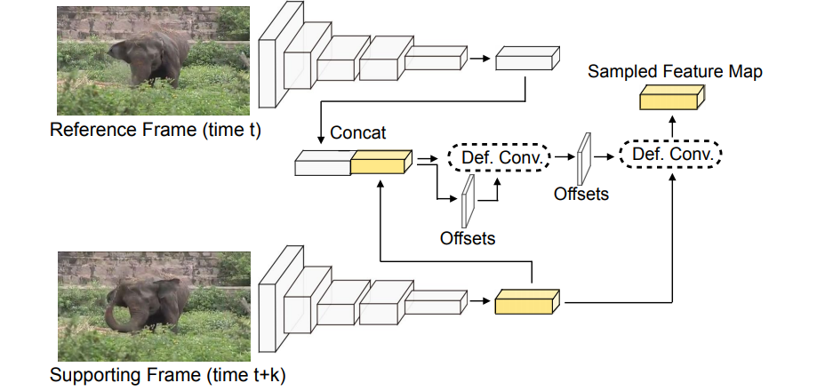

# Awesome Video-Object-Detection

This is a list of awesome articles about object detection from video.

## TODO

- [ ] Add summary for D&T
- [ ] Add summary for Scale-Time-Lattice
- [x] Add summary for STMN
- [x] Add summary for STSN
- [x] Add summary for MANet

## Datasets

### ImageNet VID Challenge
- **Site**: http://image-net.org/challenges/LSVRC/2017/#vid
- **Kagge**: https://www.kaggle.com/account/login?returnUrl=%2Fc%2Fimagenet-object-detection-from-video-challenge

### VisDrone Challenge
- **Site**: http://aiskyeye.com/

## Paper list

### 2016

#### Seq-NMS for Video Object Detection
- **Date**: 26 Feb 2016
- **Arxiv**: https://arxiv.org/abs/1602.08465
- **Motivation**: Smoothing the final bounding box predictions across time.
- **Summary**:  Constructing a temporal graph from overlapping bounding box detections across the adjacent frames, and using dynamic programming to select bounding box sequences with the highest overall detection score.

#### T-CNN: Tubelets with Convolutional Neural Networks for Object Detection from Videos
- **Date**: 9 Apr 2016
- **Arxiv**: https://arxiv.org/abs/1604.02532
- **Summary**:  Using a video object detection pipeline that involves predicting optical flow first, then propagating image level predictions according to the flow, and finally using a tracking algorithm to select temporally consistent high confidence detections.
- **Performance**: 73.8% mAP on ImageNet VID validation.
- **Code**: https://github.com/myfavouritekk/T-CNN

#### Object Detection from Video Tubelets with Convolutional Neural Networks
- **Date**: 14 Apr 2016
- **Arxiv**: https://arxiv.org/abs/1604.04053
- **Code**: https://github.com/myfavouritekk/vdetlib

#### Deep Feature Flow for Video Recognition
- **Date**: 23 Nov 2016
- **Arxiv**: https://arxiv.org/abs/1611.07715
- **Performance**: 73.0% mAP on ImageNet VID validation at 29 fps on a Titan X GPU.
- **Code**: https://github.com/msracver/Deep-Feature-Flow

### 2017

#### Object Detection in Videos with Tubelet Proposal Networks
- **Date**: 21 Feb 2017
- **Arxiv**: https://arxiv.org/abs/1702.06355

#### Flow-Guided Feature Aggregation for Video Object Detection
- **Date**: 29 Mar 2017
- **Arxiv**: https://arxiv.org/abs/1703.10025
- **Motivation**: Producing powerful spatiotemporal features.
- **Performance**: 76.3% mAP at 1.4 fps or 78.4% (combined with [Seq-NMS](https://arxiv.org/abs/1602.08465)) at 1.1 fps on ImageNet VID validation on a Titan X GPU.
- **Code**: https://github.com/msracver/Flow-Guided-Feature-Aggregation

#### Detect to Track and Track to Detect
- **Date**: 11 Oct 2017
- **Arxiv**: https://arxiv.org/abs/1710.03958
- **Motivation**: Smoothing the final bounding box predictions across time.
- **Summary**: Proposing a ConvNet architecture that solves detection and tracking problems jointly and applying a Viterbi algorithm to link the detections across time.
- **Performance**: 79.8% mAP on ImageNet VID validation.
- **Code**: https://github.com/feichtenhofer/Detect-Track

#### Towards High Performance Video Object Detection
- **Date**: 30 Nov 2017
- **Arxiv**: https://arxiv.org/abs/1711.11577
- **Motivation**: Producing powerful spatiotemporal features.
- **Performance**: 78.6% mAP on ImageNet VID validation at 13 fps on a Titan X GPU.

#### Video Object Detection with an Aligned Spatial-Temporal Memory
- **Date**: 18 Dec 2017
- **Arxiv**: https://arxiv.org/abs/1712.06317
- **Motivation**: Producing powerful spatiotemporal features.
- **Architecture**:

- **Summary**: Proposing 1. a novel **Spatial-Temporal Memory module (STMM)** (as the recurrent computation unit) to **model** long-term temoral appearance and motion dynamicis; 2. a novel **MatchTrans module** to **align** the Spatial-Temporal Memory (feature maps) across frames.
Assuming $F_t$ as the appearane feature for the current frame and $M^{\rightarrow}_{t-1}$ as the the feature of all previous frames, the **STMM updates $M^{\rightarrow}_{t}$ with the input $F_t$ and $M^{\rightarrow}_{t-1}$**. Two STMMs are used to obtain feature maps from both directions and the final feature maps are the concatenation of $M^{\rightarrow}_{t}$ and $M^{\leftarrow}_{t}$. The **MatchTrans module** computes transformation coefficients $\Gamma$ for position (x,y) from $M_{t-1}$ to $M^{'}_{t-1}$ (' means matched to $F_t$) by **measuing the similarity** between $F_t(x,y)$ and $F_{t-1}(x+i,y+j)$. The transformation coefficients are then used to synthesize $M^{'}_{t-1}$ by **interpolating** the corresponding $M_{t-1}$ feature vectors: $M^{'}_{t-1}(x,y)=\sum_{i,j \in \{-k,...k\}} \Gamma_{x,y}(i,j) \cdot M_{t-1}(x+i,y+j)$. Sequence length $T=7$ for training and and $T=11$ for testing. During testing, STMN detector and initial R-FCN detector detection results are ensembled.
- **Performance**: 80.5% mAP on ImageNet VID validation.
- **Demo video**: https://www.youtube.com/watch?v=Vs3LqY1s9GY.
- **Code**: http://fanyix.cs.ucdavis.edu/project/stmn/project.html

### 2018

#### Object Detection in Videos by High Quality Object Linking
- **Date**: 30 Jan 2018
- **Arxiv**: https://arxiv.org/abs/1801.09823

#### Towards High Performance Video Object Detection for Mobiles 
- **Date**: 16 Apr 2018
- **Arxiv**: https://arxiv.org/abs/1804.05830
- **Motivation**: Producing powerful spatiotemporal features.
- **Performance**: 60.2% mAP on ImageNet VID validation at 25.6 fps on mobiles.

#### Optimizing Video Object Detection via a Scale-Time Lattice
- **Date**: 16 Apr 2018
- **Arxiv**: https://arxiv.org/abs/1804.05472
- **Performance**: 79.4% mAP at 20 fps or 79.0% at 62 fps on ImageNet VID validation on a Titan X GPU.
- **Code**: https://github.com/hellock/scale-time-lattice

#### Object Detection in Video with Spatiotemporal Sampling Networks
- **Date**: 15 Mar 2018
- **Arxiv**: https://arxiv.org/abs/1803.05549
- **Motivation**: Producing powerful spatiotemporal features.
- **Architecture**:

- **Summary**: Using [deformable convolutions](https://arxiv.org/abs/1703.06211)  across space and time (instead of optical flow) to leverage temporal information for object detection in video, i.e., using **deformable convolutions** to sample relevant features from nearby frames (27 frames in total) and using **temporally aggregagtion** (per-pixel weighted summation) to generate final feature maps for detection network ([R-FCN](https://arxiv.org/abs/1605.06409)).
- **Performance**: 78.9% mAP or 80.4% (combined with [Seq-NMS](https://arxiv.org/abs/1602.08465)) on ImageNet VID validation.

#### Fully Motion-Aware Network for Video Object Detection
- **Date**: Stp. 2018
- **Paper**: http://openaccess.thecvf.com/content_ECCV_2018/html/Shiyao_Wang_Fully_Motion-Aware_Network_ECCV_2018_paper.html
- **Motivation**: Producing powerful spatiotemporal features.
- **Architecture**:

- **Summary**: Similar with [FGFA](https://arxiv.org/abs/1703.10025), but in addtion to pixel-level feature calibration and aggregagtion, [MANet](http://openaccess.thecvf.com/content_ECCV_2018/html/Shiyao_Wang_Fully_Motion-Aware_Network_ECCV_2018_paper.html) proposes the **motion pattern reasoning module** to dynamically combine (learnable soft weights) **pixel-level** and **instance-level** calibration according to the motion (optical flow by [FlowNet](https://arxiv.org/abs/1504.06852)). **Instance-level calibration** is achieved by regressing relative movements $(\Delta x , \Delta y , \Delta w , \Delta h)$ on the optical flow estimation according to proposal positions of reference frame. Final feaure maps for detection network ([R-FCN](https://arxiv.org/abs/1605.06409)) are the aggregation of nearby (13 frames in total) calibrated feature maps. Pixel-level calibration achieves better improvements for non-rigid movements while instance-level calibration is better for rigid movements and occlusion cases.
- **Performance**: 78.1% mAP or 80.3% (combined with [Seq-NMS](https://arxiv.org/abs/1602.08465)) on ImageNet VID validation.

## Comparison table

| Paper | Date | Base detector | Backbone | Tracking? | Optical flow? | Online? | mAP(%) | FPS (Titan X) |
| ---|---| ---|---|---|---|---|---|---|
| [Seq-NMS](https://arxiv.org/abs/1602.08465) | 26 Feb 2016 | [R-FCN](https://arxiv.org/abs/1605.06409) | ResNet101 | no | no | no | 76.8 | 2.3 |
| [T-CNN](https://arxiv.org/abs/1604.02532) | 9 Apr 2016 | RCNN | DeepIDNet+CRAFT | yes | no | no | 73.8 | - |
| [DFF](https://arxiv.org/abs/1611.07715) | 23 Nov 2016 | [R-FCN](https://arxiv.org/abs/1605.06409) | ResNet101 | no | yes | yes | 73.0 | 29 |
| [TPN](https://arxiv.org/abs/1702.06355) | 21 Feb 2017 | TPN | GoogLeNet | yes | no | no | 68.4 | - |
| [FGFA](https://arxiv.org/abs/1703.10025) | 29 Mar 2017 | [R-FCN](https://arxiv.org/abs/1605.06409) | ResNet101 | no | yes | yes | 76.3 | 1.4 |
| [FGFA](https://arxiv.org/abs/1703.10025) + [Seq-NMS](https://arxiv.org/abs/1602.08465) | 29 Mar 2017 | [R-FCN](https://arxiv.org/abs/1605.06409) | ResNet101 | no | yes | no | 78.4 | 1.14 |
| [D&T](https://arxiv.org/abs/1710.03958) | 11 Oct 2017 | [R-FCN](https://arxiv.org/abs/1605.06409) (15 anchors) | ResNet101 | yes | no | no | 79.8 | 7.09 |
| [STMN](https://arxiv.org/abs/1712.06317) | 18 Dec 2017 | [R-FCN](https://arxiv.org/abs/1605.06409) | ResNet101 | no | no | no | **80.5** | - |
| [Scale-time-lattice](https://arxiv.org/abs/1804.05472) | 16 Apr 2018 | [Faster RCNN](https://arxiv.org/abs/1506.01497) (15 anchors)| ResNet101 | no | no | no | 79.6 | 20 |
| [Scale-time-lattice](https://arxiv.org/abs/1804.05472) | 16 Apr 2018 | [Faster RCNN](https://arxiv.org/abs/1506.01497) (15 anchors)| ResNet101 | no | no | no | 79.0 | **62** |
| [SSN](https://arxiv.org/abs/1803.05549) (per-frame baseline for STSN) | 15 Mar 2018 | [R-FCN](https://arxiv.org/abs/1605.06409) | Deformable ResNet101 | no | no | yes | 76.0 | - |
| [STSN](https://arxiv.org/abs/1803.05549) | 15 Mar 2018 | [R-FCN](https://arxiv.org/abs/1605.06409)| Deformable ResNet101 | no | no | yes | 78.9 | - |
| [STSN](https://arxiv.org/abs/1803.05549)+[Seq-NMS](https://arxiv.org/abs/1602.08465) | 15 Mar 2018 | [R-FCN](https://arxiv.org/abs/1605.06409)| Deformable ResNet101 | no | no | no | 80.4 | - |
| [MANet](http://openaccess.thecvf.com/content_ECCV_2018/html/Shiyao_Wang_Fully_Motion-Aware_Network_ECCV_2018_paper.html) | Sep. 2018 | [R-FCN](https://arxiv.org/abs/1605.06409)| ResNet101 | no | yes | yes | 78.1 | 5 |
| [MANet](http://openaccess.thecvf.com/content_ECCV_2018/html/Shiyao_Wang_Fully_Motion-Aware_Network_ECCV_2018_paper.html)+[Seq-NMS](https://arxiv.org/abs/1602.08465) | Sep. 2018 | [R-FCN](https://arxiv.org/abs/1605.06409)| ResNet101 | no | yes | no | 80.3 | - |