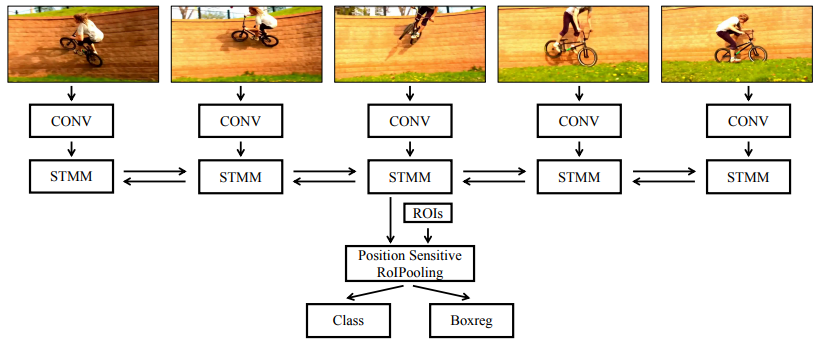

# Video Object Detection with an Aligned Spatial-Temporal Memory

## Architecture

## Summary

Proposing 1. a novel **Spatial-Temporal Memory module (STMM)** (as the recurrent computation unit) to **model** long-term temoral appearance and motion dynamicis; 2. a novel **MatchTrans module** to **align** the Spatial-Temporal Memory (feature maps) across frames.
Assuming $F_t$ as the appearane feature for the current frame and $M^{\rightarrow}_{t-1}$ as the the feature of all previous frames, the **STMM updates $M^{\rightarrow}_{t}$ with the input $F_t$ and $M^{\rightarrow}_{t-1}$**. Two STMMs are used to obtain feature maps from both directions and the final feature maps are the concatenation of $M^{\rightarrow}_{t}$ and $M^{\leftarrow}_{t}$. The **MatchTrans module** computes transformation coefficients $\Gamma$ for position (x,y) from $M_{t-1}$ to $M^{'}_{t-1}$ (' means matched to $F_t$) by **measuing the similarity** between $F_t(x,y)$ and $F_{t-1}(x+i,y+j)$. The transformation coefficients are then used to synthesize $M^{'}_{t-1}$ by **interpolating** the corresponding $M_{t-1}$ feature vectors: $M^{'}_{t-1}(x,y)=\sum_{i,j \in \{-k,...k\}} \Gamma_{x,y}(i,j) \cdot M_{t-1}(x+i,y+j)$. Sequence length $T=7$ for training and and $T=11$ for testing. During testing, STMN detector and initial R-FCN detector detection results are ensembled.
